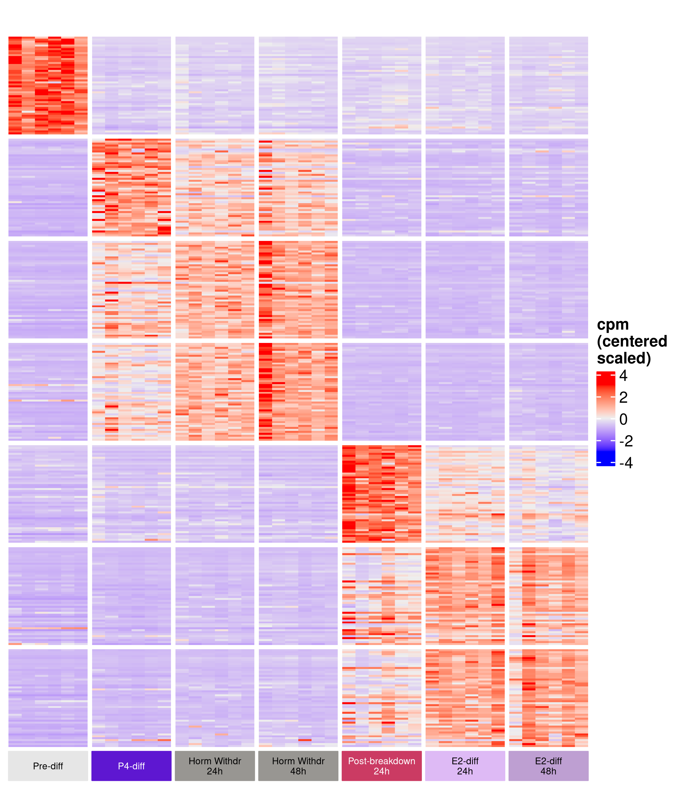
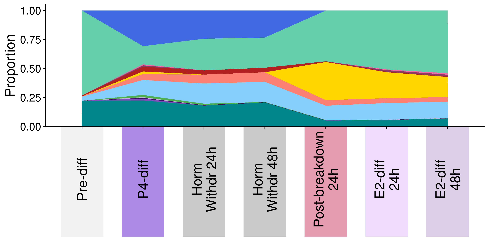
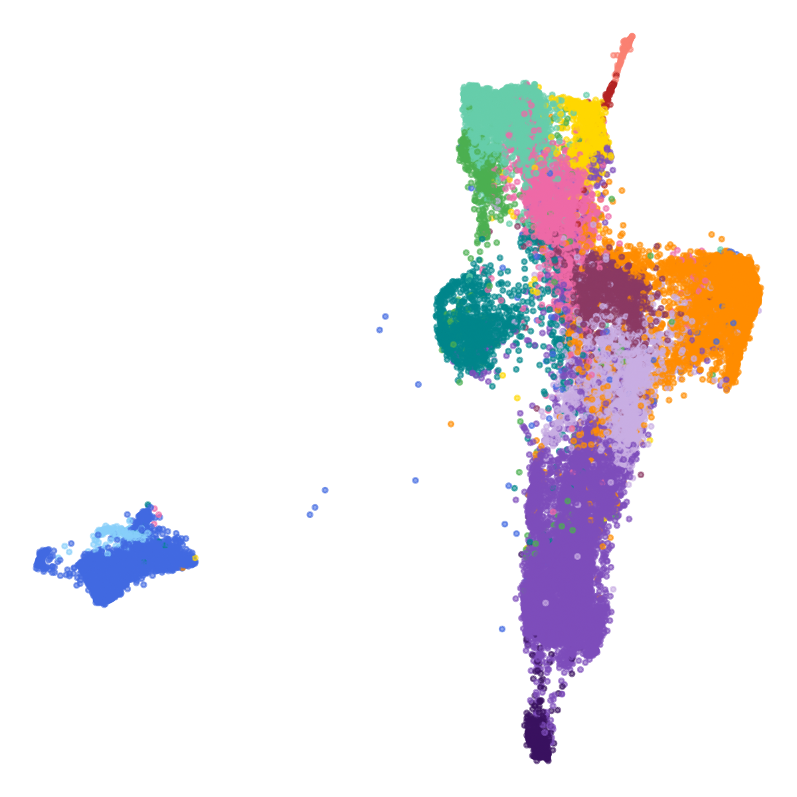
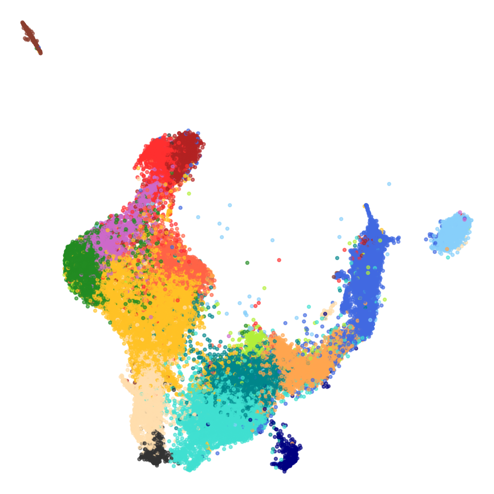
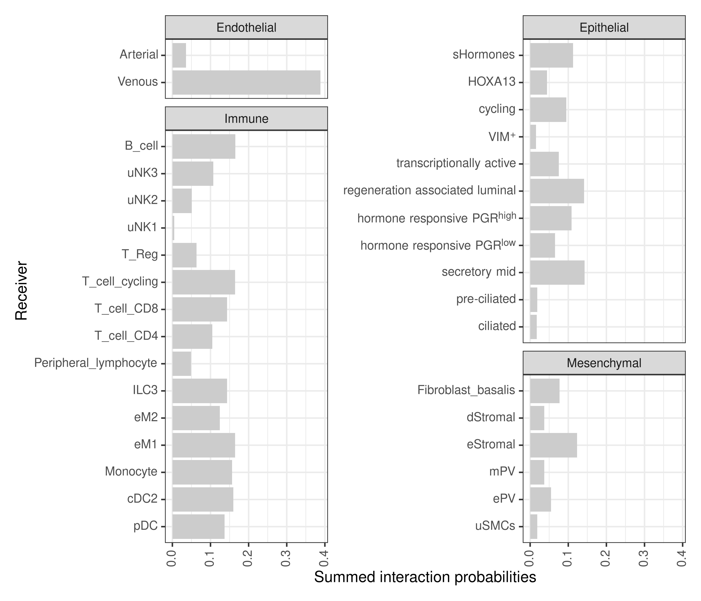
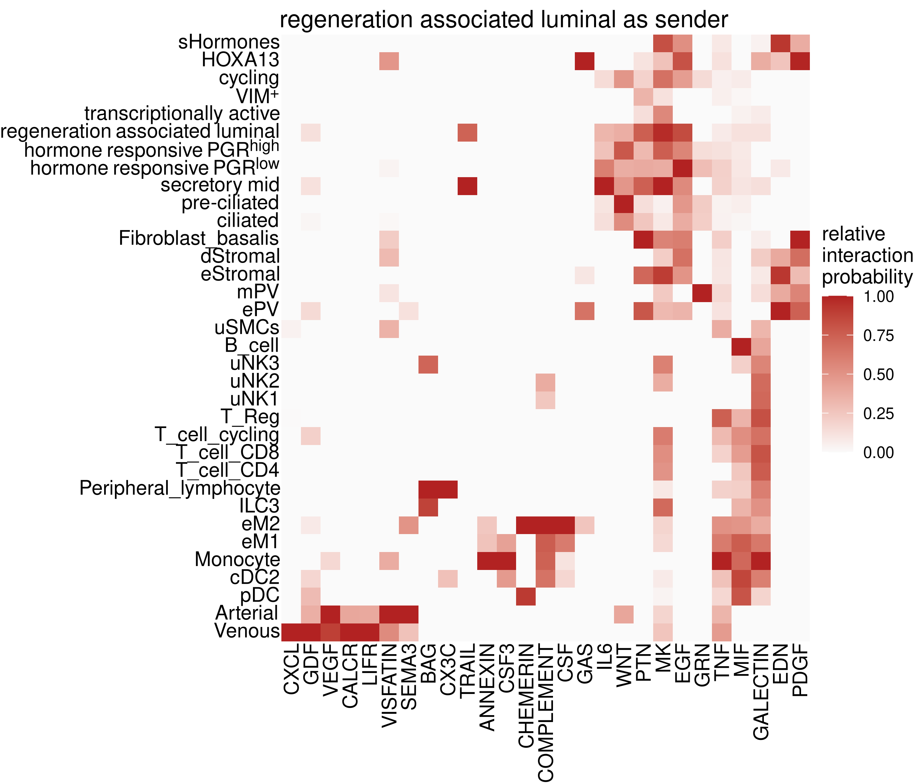

## Links to publication

The accompanying manuscript is:
Nikolakopoulou et al.: An organoid model of the menstrual cycle reveals the role of the luminal epithelium in regeneration of the human endometrium (2025)

and is available from:

- [bioRxiv]()

## Links to analysis code

All source code is available from GitHub at [https://github.com/fmicompbio/IVMC-protocol](https://github.com/fmicompbio/IVMC-protocol).
Click on a thumbnail below to jump directly to the corresponding sources.

### Bulk RNA-seq

|          |                                                                                                  |
|----------|:----------:|
| [Data processing, analysis and plotting](bulkRNAseq_timecourse/IVMC_analysis_and_plots_for_paper.html)   [Supplementary Tables](https://github.com/fmicompbio/IVMC-protocol/tree/main/bulkRNAseq_timecourse/paper_tables_IVMC/) | [{width="4cm"}](bulkRNAseq_timecourse/IVMC_analysis_and_plots_for_paper.html) |  
| [Deconvolution, processing](bulkRNAseq_timecourse/deconvolve_bulk_timecourse.html) |  |  
| [Deconvolution, paper figures](bulkRNAseq_timecourse/deconvolution_figures_for_paper.html) | [{width="6cm"}](bulkRNAseq_timecourse/deconvolution_figures_for_paper.html) |  
: {tbl-colwidths="[50,50]"}

### scRNA-seq, epithelial atlas

|          |                                                                                                  |
|----------|:----------:|
| [Data processing](scRNAseq_invivo_endometrium_epithelial_cell_atlas/process_epithelial_cell_atlas.html)   [Supplementary Tables, marker genes](https://github.com/fmicompbio/IVMC-protocol/tree/main/scRNAseq_invivo_endometrium_epithelial_cell_atlas/marker_genes_all_leiden_res0.4_annot)   [Supplementary Tables, GO term enrichments](https://github.com/fmicompbio/IVMC-protocol/tree/main/scRNAseq_invivo_endometrium_epithelial_cell_atlas/gprofiler) |  |  
| [Paper figures](scRNAseq_invivo_endometrium_epithelial_cell_atlas/epithelial_atlas_figures_for_paper.html) | [{width="4cm"}](scRNAseq_invivo_endometrium_epithelial_cell_atlas/epithelial_atlas_figures_for_paper.html) |  
: {tbl-colwidths="[50,50]"}

### scRNA-seq, timecourse

|          |                                                                                                  |
|----------|:----------:|
| [Data processing](scRNAseq_timecourse/process_organoid_scrnaseq_timecourse.html)   [Supplementary Tables, marker genes](https://github.com/fmicompbio/IVMC-protocol/tree/main/)   [Supplementary Tables, GO term enrichments](https://github.com/fmicompbio/IVMC-protocol/tree/main/scRNAseq_timecourse/gprofiler)  |  |  
| [Paper figures](scRNAseq_timecourse/scRNAseq_timecourse_figures_for_paper.html) | [{width="4cm"}](scRNAseq_timecourse/scRNAseq_timecourse_figures_for_paper.html) |  
: {tbl-colwidths="[50,50]"}

### scRNA-seq, complete atlas (CellChat analysis)

|          |                                                                                                  |
|----------|:----------:|
| [Data processing](scRNAseq_invivo_endometrium_cell_atlas/process_cell_atlas.html) |  |  
| [CellChat analysis](scRNAseq_invivo_endometrium_cell_atlas/run_cellchat.html) | [{width="4cm"}](scRNAseq_invivo_endometrium_cell_atlas/run_cellchat.html) |
| [Paper figures](scRNAseq_invivo_endometrium_cell_atlas/cell_atlas_figures_for_paper.html) | [{width="4cm"}](scRNAseq_invivo_endometrium_cell_atlas/cell_atlas_figures_for_paper.html) |
: {tbl-colwidths="[50,50]"}

